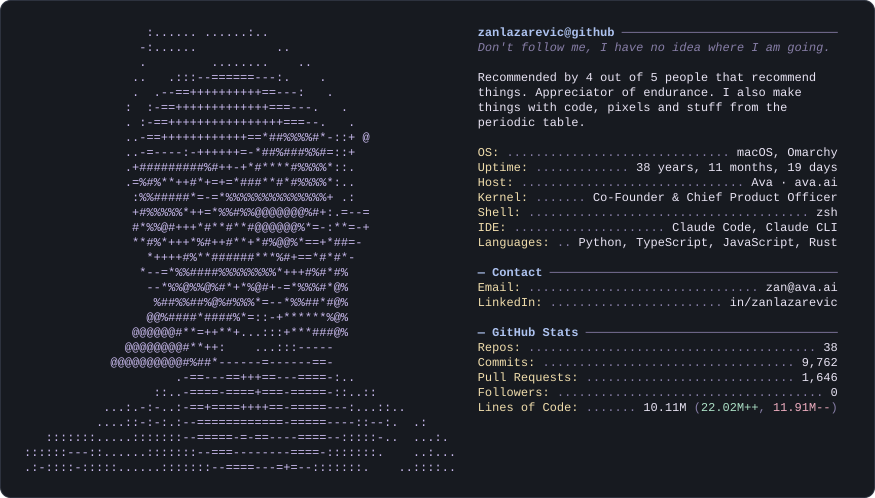

<picture>
  <source media="(prefers-color-scheme: dark)" srcset="profile-dark.svg">
  <source media="(prefers-color-scheme: light)" srcset="profile-light.svg">
  
</picture>

<!--
Regenerate:
  build/fetch_stats.sh                                   # GitHub numbers → build/stats.json
  swift build/mask_person.swift assets/photo.jpg assets/photo-mask.png   # only when the photo changes
  python3 build/build_profile.py                         # → profile-dark.svg, profile-light.svg
-->
